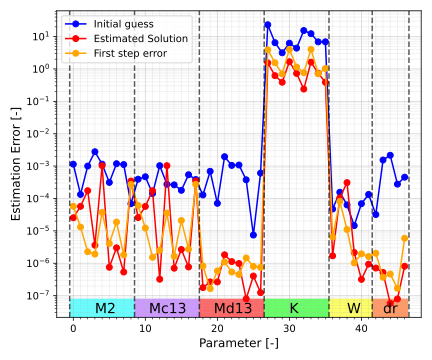
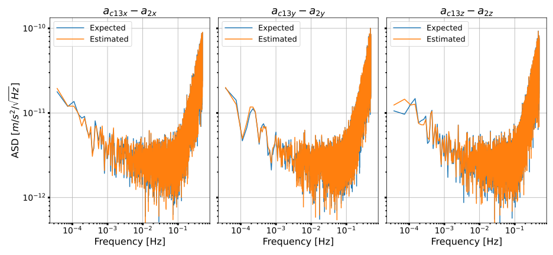

# Accelerometer Calibration

## Setup

The project uses TudatPy as a base package plus a few additional packages. You can install environment through ```conda``` using this 
[environment.yml](./environment_Acc_Calib.yml) file. If you want the latest packages from TudatPy, install it using the ```environment.yml```
[TudatPy installation](https://docs.tudat.space/en/latest/_src_getting_started/quickstart.html#installation) file on the TudatPy website and manually 
install the missing packages if needed.

The project has the following structure:
```
📦 nggm
├── 📂 Tools: Contains all the functions. No executable code.
│   ├── 📄 CalibrationTools.py: Functions to build the linearized least squares problem and solve it.
│   ├── 📄 Dynamics.py: Function to setup the orbit propagation for TudatPy.
│   └── 📄 PlotTools.py: Functions to aid plotting.
|   └── 📄 SignalProcessingUtilities.py: Classes and functions to create the accelerometer object and the signal.
|   └── 📄 Utilities.Initialisation.py: Functions to initialize the accelerometer objects.
├── 📂 SimulationOutput: The folders are auto created if they do not exist.
│   ├── 📂 figures: Stores the figures.
│   └── 📂 Output: Stores the data from the simulation.
├── 📂 Matlab_functions
│   └── 📂 angular_rates: Functions to calculate the angular rate and acceleration from quaternions.
|   └── 📂 gravity: Functions to calculate the gravity gradients.
|   |   └── 📄 GOCO05c.csv: Spherical harmonic gravity field model.
├── 📄 main.py: The main file to generate a reference orbit.
├── 📄 environment_Acc_Calib.yml: Environment file for the project.
```
Note: Only the files relevant to running an example calibration are highlighted here. The rest of the file functions should be clear from the name.

## Demo Calibration

1. Run ```main.py``` to generate a reference orbit. The spacecraft properties, orbit duration and fidelity of the gravity field model are described here.
The orbit duration is set to 2 days by default. GOCO05 with D/O 130 is used here. The simulation outputs the state vector and the additional data
described by the ```define_dependent_variables()``` function in ```Dynamics.py```. The ```save_gravity_gradients_angular_rates()``` function in ```Dynamaics.py``` runs the MATLAB
functions in python to calculate the gravity gradients and angular rates/acceleration in the body-fixed frame. All the reference orbit data is saved in the ```SimulationOutput/Output/Orbit_data``` folder.
```
python3 main.py
```
2. Run ```Demo/demo_calibration.py``` to run a demo calibration. First define the shaking signal for linear and angular accelerations. Both are clumped
into a shaking dictionary. ```acceleration_setup()``` function creates the accelerometer objects with the shaking signal incorporated in the signal. It requires the shaking signal settings and the placement of the accelerometer in the body frame. 
The accelerometer imperfections are auto generated and saves the measured (observed) signal in ```self.a_meas``` variable of the accelerometer object.
```run_calibration()``` runs the least squares problem by building the linearized least squares problem using ```CalibrationTools.py``` and solving it. 
It saves the estimated parameters ```x0.txt```, the true parameters ```x_true.txt``` generated during the accelerometer object initialization, the error between estimated and true parameters ```x_err.npy``` for each step of the least squares problem, and
```residuals.npy``` for acceleration observation residuals. The calibration data is saved in the ```SimulationOutput/Output/Demo_calibration``` folder.
```
python3 Demo/demo_calibration.py
```
Note: Uncomment Line 36 in ```SensitivityAnalysisTools.py``` to save ```residuals.npy```. It is turned off by default as the file size is large.






    

